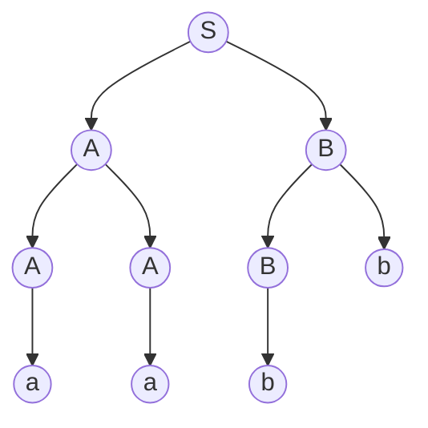

---
{"dateCreated":"2024-01-12 23:02","tags":["computational_models"],"pageDirection":"rtl","dg-publish":true,"permalink":"/computer-science/computational-models/context-free-language/","dgPassFrontmatter":true}
---

# שפה חסרת הקשר
 שפה חופשית הקשר (או שפה חסרת הקשר) היא שפה פורמלית אשר קיים דקדוק חסר הקשר המגדיר אותה. כלומר, שפה $L$ היא שפה חופשית הקשר אם קיים דקדוק חסר הקשר $G$ כך ש $L$ היא אוסף כל המילים שניתן לגזור מהסימן התחילי של $G$. ניתן להוכיח, ששפה היא חופשית הקשר אמ״מ קיים [[Computer Science/Computational Models/Pushdown automaton\|אוטומט מחסנית]] לא דטרמיניסטי המקבל אותה.
## דקדוק חסר הקשר
זהו רביעייה $G=(V,\Sigma,R,S)$ המושגים החדשים שנכנסו לחיינו הם 

* $V=\text{ variables}$ הנעלמים לשם הנוחות נעלמים נסמן באותיות גדולות ובאותיות קטנות נסמן טרמינלים שהם שילוב של נעלם עם אות מהשפה (איחוד של נעלם עם סיגמה ועל כל זה מפעילים סגור קליין).
* $R$ אוסף כללי היצירה מהצורה $\{g_{i}\rightarrow h_{i}\}_{i=1}^{|R|}$ כאשר $g_{i}\in V$ ו $h_{i}\in (V\cup \Sigma)^{*}$ 
דוגמה לכללי יצירה : 
![Pasted image 20220710183917.png](data:image/png;base64,iVBORw0KGgoAAAANSUhEUgAAAJAAAAA2CAYAAAAoAxBLAAANYUlEQVR4Ae2ceVBUV77H86rmjzeval7qzZJJZeYZHTfGuG8oyiIgyI6KiCCKYoxxcEONBh3EJYoYRR2VuGM0lqAmUdxGUVzQICAqgmyyK/vW7L3dz6sGsRvopg2QejJzu+oWp0+f3z2/+/197jmnb/8O7yG+RAW6oMB7XbAVTUUFEAESIeiSAiJAXZJPNBYBEhnokgIiQF2STzQWARIZ6JICIkBdkk80FgESGeiSAiJAXZJPNBYB+ndhQJBSUymhQdm9FywC1L16aj2boGik8uULEuNjeRifwLOMPCrq5QhaW/9ClVUP2b9qO5eLFXo7kBVn8ORZNpVvAZsIkF45u9hAWsOLyFDWL/LC03MuXl5zmeO1mO2RmTTqj2UXO9cwzzuK6X8PYWVyo0altqKUR9tmY+G8hNPZ9doatKoTAWolR3e/EajLT2CHxyQs5qznZMQVrl29SHjocb5/UoDsLe7wzngkCAJKpbL1CNcE0DBWPm8EbZ+3dFR1j6VDBjLceCIu+2Oo0zNMigC1CPeL/FVSlnodH0tDPA/Goe/e76oLDUUP+WbFfKbZWmE+2RYX32CupxchU51YBdD7w1mwP5CFU22wsLTBZXkQFxMLNPwSqDi5gP7DPNm5wxvLaf5EVXU8TIoAdTVqeuwbXj1jj9t4hjmt5NyzQqR67mjdp1NQK3lFdnYpukLaUJHI+f2HuRAdT/w/j+JjZ43r9u95UaNsAsjs1//Dny0XcehmLAm3z7F5riO2CwOJyns9VSmz2WvalwHrb5EZf5pPra1ZezW39UjWxkERoDaCdPtbQUbJ04ussR7ORx/1YazrKk7F5VCniwKdDigoTYxkx/KlHIgtQK6jnWr6anop8jm/dhZ2yw4SXyh/DdAfsDpd9BoIObmX/4GL00wOXk1qtokNYugfxhOQJUVelMKxRQ5YrzpBpkI39SJAOgLR7dWNlWTc+o71buYMGGDIvFOx1LUERlBQX5FPyuPHPO7oiLnJUT9PJkxwxP/HR5Q1ai6ilFSk3+XIusXMcrbF0syIIb3/xCfeB3hU0AyQ6W8G4fO4ZWEs0BgbxmfO0zkYdh+EKq4vmsivBkxmRcBGAvy/YIGzMaMsvAlNkugchUSAup0UPSeU5hO2yJI/Om4ht1ba3FhRR97DMLb6+uKr81jB8iULmWExFgODUUzfeIqkYo1VlSyNIMtPGOq2kfD7ieS8esyxpc5YLQ7RAGgAC2PqXjsoUPPTaRY4Tedg+AOErLN4DB2GkZsX3t7eTYeXqwNGEyez+NBtKjRZ1bhEESANMbq/KCCXSigpKqf+9ZSlrMnnx2V2fOwapAborTpWIsl5yDH/1Ww6dYe82jZzYP0PuPbuh1v4KxQoaciNYsuMCRguUANk9l+/wzDwAeUqU5mEJycCcHD24kTUM5J3eWEwyZcoyWuoAaE0hZOrPLBbGMidwgatXooAaZWluyoVVGbf5OvPP8Vn1Zf4b/Bn7ZJ52Fs787eTMdTKda8t2nugQFL8gtjoBAobtdjJUvjabiSjnXzYFLiVgLW+eFqMxXjZQfUI9HsDJnnMx/fvW9gWsJq5Ux1w9z/G05TbbLQzw+LrSPW0qnJAqCXlbBAznDw5Fpne3iUQU1q1qtJtlQINFRlcP7aHr/zXsW69P5uC9nHicgy5NY061xWd615JYWwEB4O2sDlwF9+EXeNuVCRRCemU1SuhLoMrp68Tcz+C43u+ZuvWQHaHXiAupwxpdQ73Ll7lQX77tY60OJPoG5GkZpdodUscgbTK0r2VgkJGfXUVlVUSahqkKLUMIN3SoyAgq69BUl1Do0xXJwLyhlokkhrqZW2mwU44IQLUCdFEE7UCIkBqLcRSJxQQAeqEaKKJWgERILUWYqkTCogAdUI00UStgAiQWgux1AkFRIA6IZpoolZABEithVjqhAIiQJ0QTTRRKyACpNZCLHVCARGgTogmmqgV6PEACQr5L5acrpbp55QEFDK5zrTTN2eqzuJOxH3t2X7KCtJ+iiY2q/ytrk31W5v+BH2BmqQoIuJy3rjQqlDwnMibj3gp15H406qx+k3PBkhRSNSBrXx54gG16mv6/y3lR3MgYAvfJJR37EfyYaYYuLBf9Ut521f9QwJdnfE8/JAqqZbPNdsrXnF91wZWn3xES66h5sfqsoK0DTb09j6lrtIoKS5tZpzxQsIlGklqGp/rKvZogBRJ3zJjdH9+azCb83p2D+gSoHvrpaSHfMbIj//Mfy44Q7muH8RVnSbuZfwHVuyo0wJI7T38LI2xDb5LZau01fbeKhMOYm3Qi/cHeRMh6ejXdQXJK414z/VI+5Oo8svOrqbvIFdCK/9dABJqid02m+HOnswc2BfT0Cz904ZW6d6+Ul6Ry+PbVzl7JoyIe88pa5vZXp1AkJMFDvOcGdjbnv0vmzbUaO9AL0AmOO65Q/7zGC6Fn+H7G7Hkts1CFKqJ9nOkn5M3Hv0+xvFMTgca6Aeo32A3TpUWkRoVwdlzF7mT/PJfeF9Y6W38rCfhuPcG91aY8Z7xRpJaktS1h6xrtannWWRpxAgjcxycrDE0GMD4xcdIe5NVKCC5uh3zCTMIfnCJNcN68UnQY527J95mBDKznsToMSbYONhiOnIQIxx9OZfZktMMFF/DZ5wh9qFxxPsY8oFdEKk6NdAPUP9BpsyYMpaRptbYWE5kxPAJzA2+TK7O3KIem5GopCh8AxPNZnPoaS7K9H1M/K0BS36q6RwkQiUPzoRzt6B9Rt6bEyqqeFUkQfY6QOXXv8TIwJzNLbsclIWc93VmjNdOkoqqyd9qy6+HLeGOro1g+kYgi6G8P3QuF19Wq3JLqc2Lxm/yKEx8T5LbNOspeHV8OYON5hGeXw7Pd2Laayx+jzQAe+O8qqAfoAF//IA/rb3VvJaSVhB3dCXmJs5sv5mvM3uyZ66BGjIIXWzPWPcAIp9mUpCfwFcTetH7szBK2iwpmrIB62qpra6mWuchIf/seibZ+hD6pPkfH7TSXhVCWT2VRS/JSk8jNTWFuH9uw37QGFbebA6wPPkci8wnMW3HORJzXlEUu4tJH/bF/YIqyV3LSy9AoxizOoKSlmz8+hKit89h4pRlfF8sg7pk/jHLlKHzgolPy6EgP451xv0YuepHytto0Ny7foD6/68Zf89puQkFKh5fZpmTJXP3Xte5nuuBACmpifmW+WbD+cTIiulu7ri7z2La+IF8NGgqIVmtv4vIch7x43ehHD50iEMdHjv5dHQv/uMvlqy9lKax3Vd180pIv3qYVfPccLKzw9bOAfsphgzsO4oVKoCUEuJCVmI8ZDDjbZxxc3fHfdY0JvT9kD7u+0jXNgXoA8hyAlZBd9SLaGkl8ceWYmE2j+Pp9VRF7WPamMEMMbXDdVazBvaGBvQxnMvJXG07KPQD1G/gVELeLKIFGlNvEeBqw/Rt58nWCmVPnMJkpdwOXoKV9TSWbwpmf0gIISEh7NsdwPQRf8U2+CeqNb79yPOfcu2HME6dOtXxsXsNNsOHMsrFh723MmgVgvyb+NmZYbIkmDs5lU0jiiRpD7b9RzcBJBQ8JNjbGauZi9i8Z3+TPyqfdvu5MXqwNdsSKttPAXoBGovRuiuUtnzNbyjl/s75GFv/jfCsHK5smIuJrQd+gXtea3CA3YFrcDIcjfuheC2LX/0A9e8zmS15LQ9EBCRPr7LKeTKzgy9T+K8CkDT7Dls9nZjh/y3PqzS+BskkXP/ClhE2a7hRpnXS0DKPvK4S6kk5HYjPxmM8KGqFTnOD5HAWGJvguO8Gxaqv1dISbm105q9/GYVvZCl51w7gYe/C+vOPkGgILS2Jwc98OBYbLlOiAXXTSfUBZDGMj0yXczmrqmkNVJdzn0AXE0w+D+FRYgRfTLPDY9dF8jT2SMsleYQvtWXCrM1EV7TVQD9AAz7sg+HO26jkExorSTgZgIOlIwERqa1HZA0le9YUJtSTdmEnbvaufHUpmXrNoAgKCu8fYNo4E5ZfyNS+7tC48NZFGUUpSWRUaIFH1bA6hZPLpjNmvCUzveYzz80Vj8XLcDUex6qLiURs8sbG3Y+LL6pbjzTSau7vcGec5eeczVdv2GvqWw9A66ynYOvijON0V+Ys8GamnRkTbb3Zd/85cd/6Y+fgxYG7ma3/WYOijvRL23EysyPgRm4bDd4CoHE2eM90ZurMOcyb7YKVqTkz1h8noUz3s6GeBRAK6srySU19QUl1+2cs8oZKspITySypbx3I1rR04p2cmlfpRF84zZHDxwm79oDkl8XkpSaRV1FLeW4GqVkFVGsMiE2dCEoaynJITsqgpO3/lusIIGU1L1MzyM7NIPHeFU4fOcSRM5eIyXiJRC6jpjiHlLRsKuradYi0ppQXz5PJLW+rQccAoXrGlZpNYcYTon74jqNHQzl/K46skhrdjyLEjYU/jyVBqUAmk/Hm0c/PM2/duiOANFsKShQyGQqdz3c0G3dU1gOQhmnzdcrfav9aDxuBNK5SLL4TCogAvRNh6LlOiAD13Ni9E56LAL0TYei5TogA9dzYvROeiwC9E2HouU6IAPXc2L0Tnv8fUzNRA7BiX4IAAAAASUVORK5CYII=)
* $S$ נעלם התחלתי.

### גזירות 
עבור דקדוק חסר הקשר אם יש כלל יצירה מהצורה $A\rightarrow z$ אז נסמן 
$uAv\underset{G}{\Rightarrow} uzv$ . כאשר $u,v$ הם טרמינלים.

עבור שתי טרמנילים (תווים ב$\Sigma$ נקראים טרמינלים בהקשר של דקדוקים חסרי הקשר) $u,v$  נסמן $u\overset{*}{\underset{G}{\Rightarrow}}v$  אם ניתן לעבור מ $u$ ל $v$ על ידי 0 או יותר גזירות.

__שפה של דקדוק__ 
$$L(G)=\{w\in\Sigma^{*}\ |\ \ S\overset{*}{\underset{G}{\Rightarrow}}w  \}$$ כלומר, שיש סדרת גזירות שתעביר אותנו מהמצב ההתחלתי $S$ אל המחרוזת.

#### עצי גזירה
טכניקה לגזירה של מילים באמצעות כללי גזירה היא עץ גזירה. בונים אותו באמצעות כללי הגזירה עד להגעת המילה הרצויה שמורכבת מתווים שכולם עלים. למשל עבור הדקדוק 

$$\displaylines{
S\to AB \\ A\to a|AA|Ab \\ B\to bB|b
}$$

נוכל לבנות עץ גזירה שהשורש שלו הוא $S$ וכל רמה $i$ בעץ תיגזר על ידי הרמה ה$i-1$ למשל:

נקבל סך הכל :

$$S\to AB\to AbB\to Abb\to AAbb\to Aabb\to aabb$$

__נגדיר__ דקדוק רב משמעי כדקדוק שניתן לייצר איתו מילה כלשהי עם יותר מעץ גזירה אחד.
## למת הניפוח לשפות חסרות הקשר 
תהי $L$ שפת חסרת הקשר. אזי, קיים $N$ כך שלכל $w\in L$ המקיים $ֿ\#w\geq n$ אזי:
קיים פירוק $w=tuxyz$ כך ש
* $|uy|>0$
* $|uxy|\leq n$
* $\forall_{i\in\mathbb{N}}:tu^{i}xy^{i}z\in L$

## סגירויות 
השפות חסרות הקשר סגורות ל 
* איחוד
* שרשור
* סגור קלין
* reverse
* prefix

והן אינן סגורות ל 
* חיתוך
* משלים