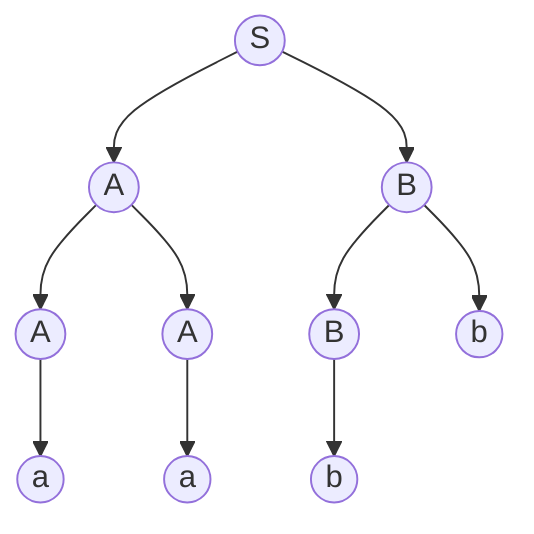

---
{"dateCreated":"2024-01-12 23:02","tags":["computational_models"],"pageDirection":"rtl","dg-publish":true,"permalink":"/computer-science/computational-models/context-free-language/","dgPassFrontmatter":true}
---

# שפה חסרת הקשר
 שפה חופשית הקשר (או שפה חסרת הקשר) היא שפה פורמלית אשר קיים דקדוק חסר הקשר המגדיר אותה. כלומר, שפה $L$ היא שפה חופשית הקשר אם קיים דקדוק חסר הקשר $G$ כך ש $L$ היא אוסף כל המילים שניתן לגזור מהסימן התחילי של $G$. ניתן להוכיח, ששפה היא חופשית הקשר אמ״מ קיים [[Computer Science/Computational Models/Pushdown automaton\|אוטומט מחסנית]] לא דטרמיניסטי המקבל אותה.
## דקדוק חסר הקשר
זהו רביעייה $G=(V,\Sigma,R,S)$ המושגים החדשים שנכנסו לחיינו הם 

* $V=\text{ variables}$ הנעלמים לשם הנוחות נעלמים נסמן באותיות גדולות ובאותיות קטנות נסמן טרמינלים שהם שילוב של נעלם עם אות מהשפה (איחוד של נעלם עם סיגמה ועל כל זה מפעילים סגור קליין).
* $R$ אוסף כללי היצירה מהצורה $\{g_{i}\rightarrow h_{i}\}_{i=1}^{|R|}$ כאשר $g_{i}\in V$ ו $h_{i}\in (V\cup \Sigma)^{*}$ 
דוגמה לכללי יצירה : 

* $S$ נעלם התחלתי.

### גזירות 
עבור דקדוק חסר הקשר אם יש כלל יצירה מהצורה $A\rightarrow z$ אז נסמן 
$uAv\underset{G}{\Rightarrow} uzv$ . כאשר $u,v$ הם טרמינלים.

עבור שתי טרמנילים (תווים ב$\Sigma$ נקראים טרמינלים בהקשר של דקדוקים חסרי הקשר) $u,v$  נסמן $u\overset{*}{\underset{G}{\Rightarrow}}v$  אם ניתן לעבור מ $u$ ל $v$ על ידי 0 או יותר גזירות.

__שפה של דקדוק__ 
$$L(G)=\{w\in\Sigma^{*}\ |\ \ S\overset{*}{\underset{G}{\Rightarrow}}w  \}$$ כלומר, שיש סדרת גזירות שתעביר אותנו מהמצב ההתחלתי $S$ אל המחרוזת.

#### עצי גזירה
טכניקה לגזירה של מילים באמצעות כללי גזירה היא עץ גזירה. בונים אותו באמצעות כללי הגזירה עד להגעת המילה הרצויה שמורכבת מתווים שכולם עלים. למשל עבור הדקדוק 

$$\displaylines{
S\to AB \\ A\to a|AA|Ab \\ B\to bB|b
}$$

נוכל לבנות עץ גזירה שהשורש שלו הוא $S$ וכל רמה $i$ בעץ תיגזר על ידי הרמה ה$i-1$ למשל:

נקבל סך הכל :

$$S\to AB\to AbB\to Abb\to AAbb\to Aabb\to aabb$$

__נגדיר__ דקדוק רב משמעי כדקדוק שניתן לייצר איתו מילה כלשהי עם יותר מעץ גזירה אחד.
## למת הניפוח לשפות חסרות הקשר 
תהי $L$ שפת חסרת הקשר. אזי, קיים $N$ כך שלכל $w\in L$ המקיים $ֿ\#w\geq n$ אזי:
קיים פירוק $w=tuxyz$ כך ש
* $|uy|>0$
* $|uxy|\leq n$
* $\forall_{i\in\mathbb{N}}:tu^{i}xy^{i}z\in L$

## סגירויות 
השפות חסרות הקשר סגורות ל 
* איחוד
* שרשור
* סגור קלין
* reverse
* prefix

והן אינן סגורות ל 
* חיתוך
* משלים